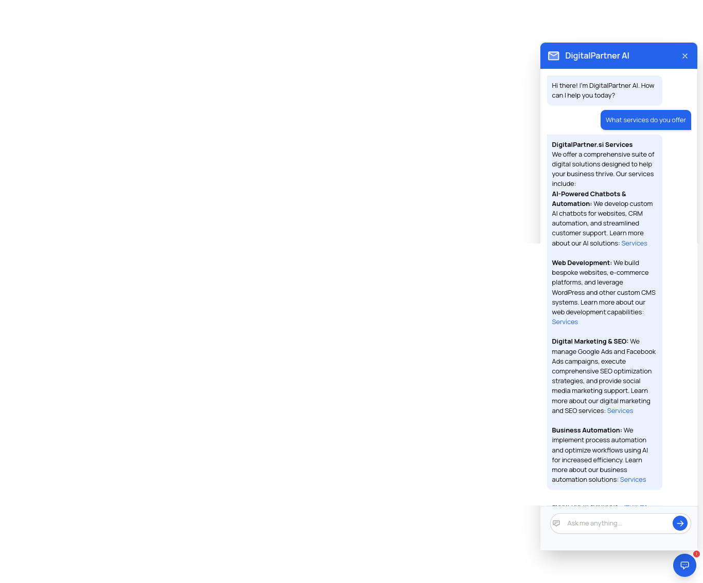

# DigitalPartner AI Assistant

The DigitalPartner AI Assistant is an innovative chatbot application designed to provide users with quick and accurate responses to their questions in a conversational format. Built with modern web technologies, this chatbot aims to enhance user experience through its intuitive interface and responsive design.

[View the website](https://digitalpartner.si/)

## Features

- **Conversational Interface**: Engage in natural language conversations with the chatbot.
- **Responsive Design**: The chatbot adapts seamlessly to various screen sizes, making it accessible on both desktop and mobile devices.
- **User-Friendly**: Simple input field for user queries, with instant feedback and responses.
- **Event-Driven Interactions**: The chatbot responds to user actions, such as pressing Enter to submit a query.

## Installation

To set up the DigitalPartner AI Assistant on your local machine, follow these steps:

### Clone the Repository

Use the following command to clone the repository to your local machine:

## Usage

Once the application is open in your browser, you can start using the chatbot:

- **Input Queries**: Type your questions or requests into the input field and press Enter. The chatbot will process your input and provide a response.
- **Toggle Visibility**: The chatbot window can be shown or hidden as needed, allowing for a clean user interface.

## Technologies Used

The DigitalPartner AI Assistant is built using the following technologies:

- **HTML**: For structuring the content and layout of the application.
- **CSS**: Styled with Tailwind CSS to ensure a modern and responsive design.
- **JavaScript**: Implements the chatbot functionality and manages user interactions.

## Contributing

We welcome contributions from the community! If you have suggestions for improvements, bug fixes, or new features, please follow these steps:

1. **Fork the Repository**: Create your own copy of the repository.
2. **Create a New Branch**: Use a descriptive name for your branch (e.g., `feature/new-feature`).
3. **Make Your Changes**: Implement your changes in the codebase.
4. **Submit a Pull Request**: Once your changes are ready, submit a pull request for review.

## License

This project is licensed under the MIT License - see the LICENSE file for details.

## Acknowledgments

- Thanks to the open-source community for the libraries and tools that made this project possible.
- Special thanks to all contributors who help improve this project.
